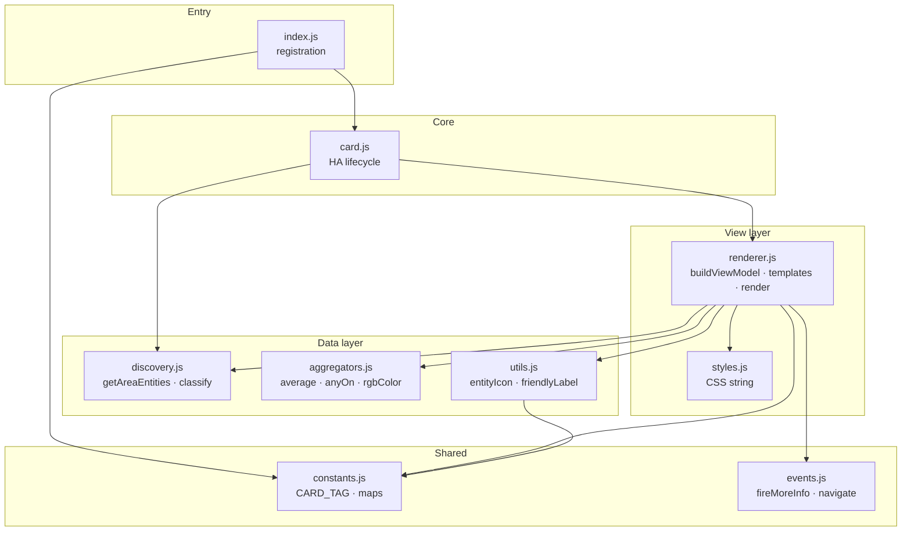
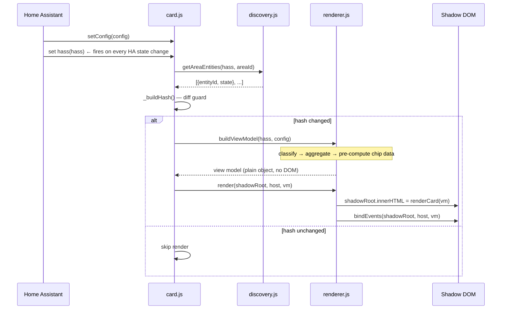
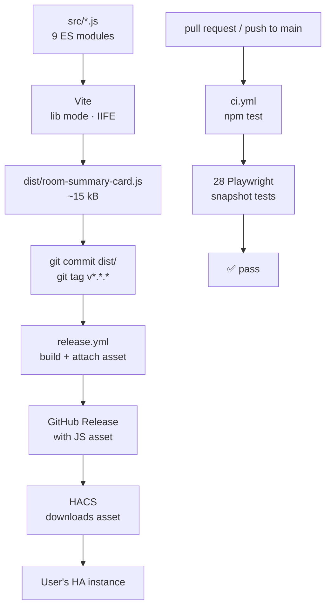

# Development Guide — room-summary-card

Technical reference for contributors and developers who want to understand, extend, or fork the card.

---

## Architecture overview

The source is split into single-responsibility modules under `src/`. Vite bundles them into a single IIFE at `dist/room-summary-card.js` for HACS distribution.

### Module dependency graph



### Data flow



### Build & CI pipeline



No framework. Pure functions throughout except the web component class and the final DOM write.

---

## File structure

```
card-ha/
├─ src/                        # source modules — edit these
│  ├─ index.js                 # entry: registration + customElements.define
│  ├─ card.js                  # RoomSummaryCard — HA lifecycle only
│  ├─ constants.js             # CARD_TAG, CARD_VERSION, icon maps
│  ├─ styles.js                # CSS string (Shadow DOM)
│  ├─ discovery.js             # getAreaEntities() + classify()
│  ├─ aggregators.js           # average(), anyOn(), rgbColor()
│  ├─ utils.js                 # entityIcon(), friendlyLabel()
│  ├─ events.js                # fireMoreInfo(), navigate()
│  └─ renderer.js              # buildViewModel() + templates + render()
├─ dist/
│  └─ room-summary-card.js     # built IIFE — commit before tagging
├─ tests/
│  ├─ fixture.html             # test harness: box-stub icons, animations off, mountCard()
│  └─ e2e/
│     ├─ card.spec.js          # 28 Playwright snapshot tests (one per feature/state)
│     └─ snapshots/            # committed baseline PNGs — ground truth for CI
│        └─ chromium/
├─ .github/
│  └─ workflows/
│     ├─ ci.yml                # runs E2E tests on every push / PR to main
│     └─ release.yml           # builds + creates GitHub release on v* tag
├─ hacs.json                   # HACS metadata
├─ LICENSE                     # MIT
├─ README.md                   # user documentation
├─ DEVELOPMENT.md              # this file
├─ IDEA.md                     # original product specification
├─ dev.html                    # interactive dev harness (Iconify icons, scenario buttons)
├─ playwright.config.js        # Playwright: Chromium, Vite web server, snapshot paths
├─ vite.config.js              # Vite lib mode: src/index.js → dist/room-summary-card.js
└─ package.json                # scripts: dev, build, test, test:update, test:ui
```

---

## How Home Assistant integrates custom cards

### Resource loading

HA loads the JS file as a standard ES module via `<script type="module">`. The file runs once at page load. `customElements.define` registers the tag globally in the browser's custom element registry.

### Card lifecycle

HA creates one instance of `RoomSummaryCard` per card on the dashboard.

| HA call | When | What to do |
|---|---|---|
| `setConfig(config)` | YAML parsed or changed | Validate config; store it; call `_render()` |
| `set hass(hass)` | Any state change in HA | Diff; re-render only if area state changed |
| `getCardSize()` | Layout calculation | Return integer height hint (rows) |
| `getConfigElement()` | Visual editor requested | Return `<ha-form>` element (optional) |
| `getStubConfig()` | Card picker "Add card" | Return minimal valid config object |

### State model

```javascript
hass.states        // { [entity_id]: StateObject }
hass.entities      // { [entity_id]: EntityRegistryEntry }
hass.devices       // { [device_id]: DeviceRegistryEntry }
hass.areas         // { [area_id]:   AreaRegistryEntry }
```

`StateObject` shape (relevant fields):
```javascript
{
  state: "on",                          // string — current state value
  attributes: {
    friendly_name: "Living Room Lamp",
    device_class: "motion",
    unit_of_measurement: "°C",
    icon: "mdi:thermometer",
    rgb_color: [255, 200, 100],         // light only
    current_temperature: 21.5,         // climate only
  },
  entity_id: "light.living_room_lamp",
  last_changed: "2024-01-01T00:00:00Z",
}
```

`EntityRegistryEntry` shape (relevant fields):
```javascript
{
  entity_id: "light.living_room_lamp",
  area_id: "living_room",      // null if not directly assigned to area
  device_id: "abc123",         // null if no device
  hidden_by: null,             // non-null means hidden — skip these
}
```

---

## Entity discovery logic

```
for each entity_id in hass.states:
  entry = hass.entities[entity_id]
  if entry.hidden_by → skip
  if entry.area_id === config.area → include
  else if entry.device_id and hass.devices[entry.device_id].area_id === config.area → include
```

This covers two assignment paths:
1. **Direct** — entity explicitly assigned to area in Settings → Areas
2. **Via device** — entity belongs to a device that is assigned to the area

Entities assigned only via labels or floors are not discovered (HA doesn't expose these in the frontend `hass` object).

---

## Performance: the diff guard

`set hass` is called by HA on every state change in the entire installation. Without a guard, a state change in any entity would trigger a full DOM rebuild of every card.

`_buildHash()` builds a deterministic string from the states of area entities only:

```javascript
_buildHash() {
  return this._getAreaEntities()
    .map(({ entityId, state }) =>
      `${entityId}=${state.state}|${state.attributes?.rgb_color ?? ''}|${state.attributes?.current_temperature ?? ''}`)
    .sort()
    .join(';');
}
```

The hash includes:
- Entity state value
- `rgb_color` (changes when a color light changes color without changing `state`)
- `current_temperature` (climate attribute — doesn't change `state`)

`_render()` is called only when the hash changes from the previous call.

**Trade-off:** `_getAreaEntities()` runs on every `set hass` call to build the hash. This is a read-only pass through `hass.entities` keys — cheap. The full DOM rebuild (innerHTML) runs far less often.

---

## Rendering strategy

The card uses `innerHTML` on the Shadow Root for simplicity — no virtual DOM, no Lit reactive properties. This is intentional: the diff guard ensures re-renders are infrequent enough that full `innerHTML` replacement has no perceptible cost.

`src/renderer.js` handles all rendering in two steps:

```javascript
// 1. buildViewModel() — pure, no DOM access
const vm = buildViewModel(hass, config);   // → plain object

// 2. render() — single innerHTML write, then bind events
export function render(shadowRoot, host, vm) {
  shadowRoot.innerHTML = vm.error ? renderErrorCard(vm.error) : renderCard(vm);
  if (!vm.error) bindEvents(shadowRoot, host, vm);
}

// bindEvents() targets the freshly-written DOM:
function bindEvents(shadowRoot, host, { navPath }) {
  shadowRoot.querySelectorAll('.chip[data-entity]').forEach(el => {
    el.addEventListener('click', e => { e.stopPropagation(); fireMoreInfo(host, el.dataset.entity); });
  });
}
```

Event listeners are re-bound after every `innerHTML` write — the previous DOM and its listeners are discarded together.

If you add stateful interactions (e.g. sliders, toggles), consider switching to a targeted DOM patch in `bindEvents` instead of full `innerHTML` replacement to avoid losing input state mid-interaction.

---

## Shadow DOM and HA theme variables

The card uses HA CSS custom properties so it inherits the active theme automatically.

| CSS variable | Used for |
|---|---|
| `--primary-color` | Room icon, chip active color |
| `--primary-text-color` | Room name |
| `--secondary-text-color` | Env chips, entity labels |
| `--secondary-background-color` | Chip backgrounds |
| `--ha-card-background` | Card base background |
| `--card-background-color` | Fallback card background |
| `--error-color` | Problem badge, error card border |
| `--success-color` | Occupancy dot |
| `--warning-color` | Lights badge |
| `--mdc-icon-size` | All `<ha-icon>` size overrides |

Avoid hardcoding hex colors for any property that a theme should control.

---

## How to add a new entity type

Example: add `fan.*` entities to a dedicated fan badge instead of the generic chip strip.

**Step 1** — add a bucket in `src/discovery.js` → `classify()`:

```javascript
const out = {
  // ... existing buckets
  fans: [],   // add this
  others: [],
};

// In the for-loop, before the others fallback:
} else if (domain === 'fan') {
  out.fans.push(item);
}
```

**Step 2** — expose computed fan data in `src/renderer.js` → `buildViewModel()`:

```javascript
const activeFans = c.fans.filter(f => f.state.state === 'on');
// add to the returned object:
fanCount: activeFans.length,
```

**Step 3** — add a template function in `src/renderer.js`:

```javascript
function renderFanBadge({ fanCount }) {
  if (!fanCount) return '';
  return `
    <div class="badge badge-fans" title="${fanCount} fan${fanCount !== 1 ? 's' : ''} on">
      <ha-icon icon="mdi:fan"></ha-icon>
      ${fanCount > 1 ? `<span>${fanCount}</span>` : ''}
    </div>`;
}
```

**Step 4** — call it in `renderCard()` (or `renderHeader()`):

```javascript
${renderFanBadge(vm)}
```

**Step 5** — add CSS in `src/styles.js`:

```css
.badge-fans {
  background: rgba(3, 169, 244, 0.15);
  color: #03a9f4;
}
```

**Step 6** — update `_buildHash()` in `src/card.js` if the entity type has attributes that change without changing `state`.

---

## How to add a config option

1. Add it to the YAML config reference in `README.md`
2. Read it in `src/renderer.js` → `buildViewModel()` via `config.your_option ?? defaultValue`
3. Expose it as a view model field and use it in the relevant template function
4. Update `getStubConfig()` in `src/card.js` if it should appear in the card picker stub
5. No validation framework — HA displays `setConfig()` thrown errors as a red card

Example — add `show_climate: false` option:

```javascript
// In buildViewModel() — src/renderer.js:
showClimate: config.show_climate !== false,   // default true

// In renderEnvRow() template function:
${vm.showClimate && vm.climIcon ? `<div class="env-chip climate" ...>` : ''}
```

---

## Firing HA events

### More-info dialog

```javascript
this.dispatchEvent(new CustomEvent('hass-more-info', {
  bubbles: true,
  composed: true,            // crosses Shadow DOM boundary
  detail: { entityId: 'sensor.living_room_temp' },
}));
```

`composed: true` is required — without it the event stops at the Shadow DOM boundary and HA never sees it.

### SPA navigation

```javascript
history.pushState(null, '', '/lovelace/my-view');
window.dispatchEvent(new CustomEvent('location-changed', {
  bubbles: true,
  composed: true,
  detail: { replace: false },
}));
```

`replace: true` replaces the history entry instead of pushing — useful for redirect-style navigation.

### Call a HA service (not used by default, provided as reference)

```javascript
this._hass.callService('light', 'toggle', { entity_id: 'light.living_room' });
```

---

## Visual editor (optional future work)

To add a GUI config editor in the dashboard card picker:

```javascript
// Add to the class:
static getConfigElement() {
  return document.createElement('room-summary-card-editor');
}

// Define a separate editor element:
class RoomSummaryCardEditor extends HTMLElement {
  setConfig(config) { /* populate form */ }
  get value() { return this._config; }  // HA reads this for the updated config
}
customElements.define('room-summary-card-editor', RoomSummaryCardEditor);
```

The editor element renders inside the card editor panel. HA calls `setConfig` with the current config and reads `value` whenever the user changes something.

For complex editors, HA's `<ha-form>` component accepts a JSON Schema and renders the form automatically:

```javascript
static getConfigElement() {
  const el = document.createElement('ha-form');
  el.schema = [
    { name: 'area',    required: true, selector: { area: {} } },
    { name: 'name',    selector: { text: {} } },
    { name: 'icon',    selector: { icon: {} } },
    { name: 'navigate_to', selector: { text: {} } },
  ];
  return el;
}
```

---

## Build and release workflow

### Local build

```bash
npm run build
# → dist/room-summary-card.js (~15 kB IIFE bundle, ready for HACS)
```

Commit `dist/room-summary-card.js` before pushing a release tag — HACS scans the default branch when no release exists yet.

### CI — tests on every push / PR

`.github/workflows/ci.yml` runs on every push to `main` and every pull request:

1. `npm ci` — clean install
2. `npx playwright install chromium` — install browser
3. `npm test` — run 28 snapshot tests against committed baselines

If a test fails, the Playwright HTML report is uploaded as a GitHub Actions artifact (7-day retention).

### Release (automated via GitHub Actions)

```bash
npm run build
git add dist/room-summary-card.js
git commit -m "chore: build v1.x.x"
git tag v1.x.x
git push && git push --tags
```

`.github/workflows/release.yml` triggers on the tag push:
1. `npm ci` — clean install
2. `npm run build` — Vite bundles `src/` → `dist/room-summary-card.js`
3. Creates a GitHub release with auto-generated notes and attaches the JS file

HACS downloads from the release asset. The committed `dist/` file is the fallback for users who add the repo before any release exists.

---

## Testing

### Run the tests

```bash
npm test                 # compare against committed baselines — 28 tests
npm run test:update      # regenerate baselines after intentional visual changes
npm run test:ui          # open Playwright interactive UI for debugging failures
```

Tests start the Vite dev server automatically (reuses an existing one locally, always starts fresh in CI).

### How snapshot testing works

Each test mounts the card with a specific `hass` state via `window.mountCard(config, stateOverrides)`, then compares a screenshot of `#mount` against a committed PNG baseline in `tests/e2e/snapshots/chromium/`.

- **Baselines are committed** — they are the ground truth. A failing test means the rendering changed unexpectedly.
- **`--update-snapshots`** — run after intentional visual changes to accept the new output as the new baseline. Always review the diff before committing.
- **Animations and transitions are disabled** in `tests/fixture.html` for deterministic screenshots.
- **Icons use a box stub** (not Iconify CDN) — a solid-color rectangle per icon. Snapshots show layout and color, not specific icon glyphs. No CDN dependency, no flaky rendering.

### What is covered (28 tests)

| Category | Tests |
|---|---|
| Normal state | Lights on with RGB tint, temperature, humidity, occupancy, climate chip, entity chips |
| Lights | Off (no badge/tint), single on (badge without count), multiple on (count badge) |
| Occupancy | Occupied (green dot), not occupied (no dot) |
| Alarms | Smoke, gas, water, all three simultaneously |
| Mold risk | Default threshold (70%), custom threshold |
| Problems | `problem` binary sensor active, unavailable entity |
| Climate | Heat, cool, off modes |
| Environmental | No sensors (env row hidden) |
| Entity chips | Visible (default), hidden (`show_entities: false`), active state (`on` class) |
| Navigation | Navigable card (`clickable` class), non-navigable |
| Error state | Area not found, area not found with name override |
| Config | Custom icon, custom name, `max_entities` limit |

### Adding a new test

1. Add a `test()` block to `tests/e2e/card.spec.js`
2. Call `mount(page, config, stateOverrides)` with the specific state
3. Assert DOM state with `expect(locator).toBeVisible()` / `.toHaveClass()` etc.
4. Call `toHaveScreenshot('my-scenario.png', SNAP)` to add a visual assertion
5. Run `npm run test:update` to write the baseline PNG
6. Commit the new `*.png` alongside the test

```javascript
test('my new scenario', async ({ page }) => {
  await mount(page, { area: 'living_room' }, {
    'binary_sensor.motion': { state: 'off', attributes: { friendly_name: 'Motion', device_class: 'motion' } },
  });
  await expect(page.locator('#mount').locator('.occupancy-dot')).not.toBeVisible();
  await expect(page.locator('#mount')).toHaveScreenshot('my-scenario.png', SNAP);
});
```

### Test fixture vs dev harness

| | `tests/fixture.html` | `dev.html` |
|---|---|---|
| Icons | Box stubs (deterministic) | Iconify CDN (real glyphs) |
| Animations | Disabled | Enabled |
| Scenarios | Via `mountCard()` API | Scenario buttons |
| Card count | Single card | Four rooms + error |
| Purpose | Automated testing | Interactive development |

---

## HACS submission checklist

Required repo files:

| File | Status | Notes |
|---|---|---|
| `dist/room-summary-card.js` | ✅ | The card itself (HACS searches `dist/` first) |
| `hacs.json` | ✅ | HACS metadata (`filename`, `homeassistant`, `render_readme`) |
| `README.md` | ✅ | Shown in HACS UI (`render_readme: true`) |
| `LICENSE` | ✅ | MIT |
| `info.md` | Optional | Shown in the HACS install dialog (separate from README) |

Remaining steps before HACS listing:
1. Push to a **public** GitHub repo
2. Create a GitHub **release** (tag e.g. `v1.0.0`) — HACS requires at least one release
3. Attach `room-summary-card.js` to the release assets, **or** confirm `content_in_root` is satisfied (file is in repo root — it is)
4. Submit via HACS → Frontend → Custom repositories, or open a PR to the [HACS default store](https://github.com/hacs/default)

---

## Testing without HA running

The repo includes a full local dev setup: a `dev.html` test harness and a Vite dev server.

### Start the dev server

```bash
npm install
npm run dev
# opens http://localhost:5173/dev.html automatically
```

Vite serves `src/` as native ES modules — no bundling in dev. Edit any `src/` file → browser hot-reloads instantly. `dev.html` imports `./src/index.js` directly.

### What dev.html provides

- All four rooms rendered: Living Room, Bedroom, Kitchen, Bathroom
- One error-state card (`nonexistent_area`) to validate error rendering
- Scenario toggle buttons:

| Button | What it tests |
|---|---|
| Normal | Baseline state |
| Smoke alarm | `binary_sensor` smoke → alarm bar |
| Gas alarm | `binary_sensor` gas → alarm bar |
| No motion | Occupancy dot disappears |
| Mold risk | Bathroom humidity → mold badge |
| Lights off | Light badge clears, background tint removed |

- `hass-more-info` and `location-changed` events logged at the bottom of the page
- `ha-card` and `ha-icon` stubbed (icons rendered via Iconify CDN — requires internet on first load, cached after)

### Mock hass structure

`dev.html` uses a `MOCK_HASS` object matching the real HA shape:

```javascript
{
  areas:    { [area_id]:   { area_id, name, icon } },
  devices:  { [device_id]: { area_id } },
  entities: { [entity_id]: { area_id, device_id, hidden_by } },
  states:   { [entity_id]: { state, attributes: { ... } } },
}
```

To add a new test entity, add matching entries to `entities` and `states` (and `devices` if it's device-assigned).

---

## Common pitfalls

### Entity not discovered

- Check the entity has an area assignment: Developer Tools → Template → `{{ states.light.my_light }}`
- `hidden_by` set on the entity in the registry → card skips it by design
- Entity assigned only via floor or label (not area or device) → not discoverable via `hass.entities`

### Card not rendering after code change

HA caches aggressively. Hard-refresh (`Ctrl + Shift + R`) or open Developer Tools → Network → Disable cache, then reload.

### `composed: true` missing on custom event

Events dispatched from inside Shadow DOM don't cross the boundary without `composed: true`. `fireMoreInfo` and `navigate` in `src/events.js` both set it correctly — maintain this if adding new events.

### `set hass` called with null / undefined

Can happen during HA initialization. `src/card.js` guards this — `_update()` is only called when both `_hass` and `_config` are set:

```javascript
// src/card.js
set hass(hass) {
  this._hass = hass;
  if (!this._config) return;   // guard: config must be set first
  const hash = this._buildHash();
  if (hash === this._stateHash) return;
  this._stateHash = hash;
  this._update();
}
```

### innerHTML event listeners lost after re-render

All `addEventListener` calls in `bindEvents()` (`src/renderer.js`) target the freshly-written DOM. They are discarded on the next `innerHTML` write together with those elements. This is intentional — `bindEvents()` is always called immediately after each `innerHTML` write, so listeners are always current.

---

## Versioning

Bump `CARD_VERSION` in `src/constants.js` with every release. The version appears in the browser console on load and in `window.customCards` — HACS reads it to detect updates.

```
MAJOR: breaking config changes (removed/renamed keys)
MINOR: new features, new config keys (backward-compatible)
PATCH: bug fixes, style tweaks
```
